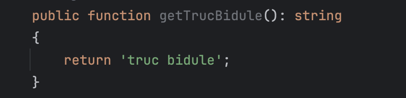
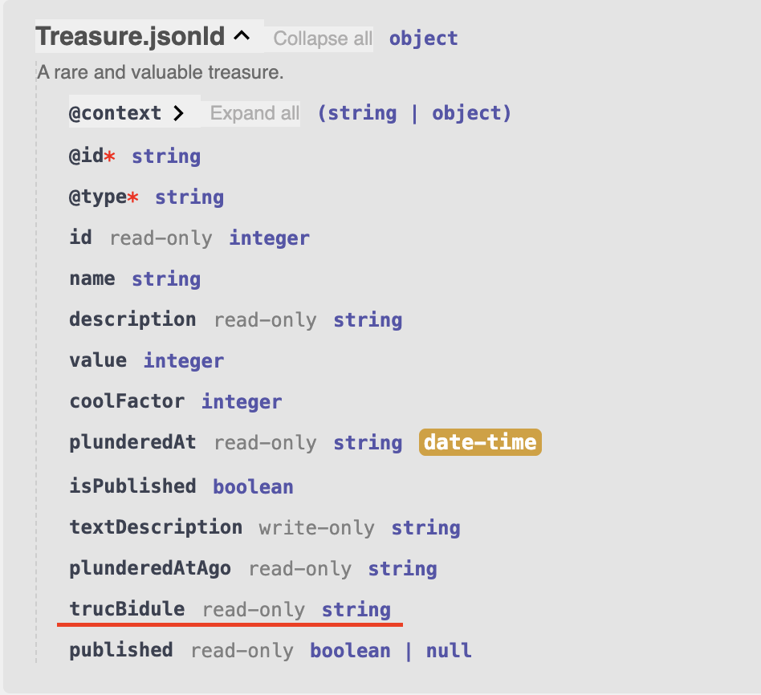

# Part 1: Mythically Good RESTful APIs

## Lexique


**OpenAPI (anciennement Swagger Specification)**
> C'est un standard de description d'API REST dans un format JSON ou YAML.

**Swagger**
> C'était le nom original, c'est aujourd'hui une suite d'outils autour d'OpenAPI.

**Swagger UI**
> C'est une interface web interactive générée à partir da la config OpenAPI.

**RDF (Resource Description Framework)**
> C'est un standard du W3C conçu pour décrire des ressources et leurs relations.


**JSON-LD (JSON for Linked Data)**
> JSON-LD est un standard du W3C conçu pour représenter des données RDF.

**Hydra**
> Hydra est un vocabulaire RDF du W3C conçu pour décrire les API pour les machines.


## #[ApiResource]

Dès qu'on applique l'attribut `#[ApiResource]` sur une entité doctrine, on a automatiquement une ressource Api Platform avec le CRUD complet dans la doc `/api`.

Par défaut, ça retournera toutes les propriétés publiques et tous les getters, donc on peut créer des `propriétés virtuelles` très facilement en faisant :



Et ça générera automatiquement ce schéma de réponse :



```python
def exemple():
return "code"
```

| Colonne 1 | Colonne 2 |
|-----------|-----------|
| Donnée A  | Donnée B  |

- [x] Tâche complétée
- [ ] Tâche à faire

> ⚠️ **Attention**
>
> Contenu important à ne pas manquer

> 💡 **Conseil**
>
> Astuce utile pour l'utilisateur

> ℹ️ **Information**
>
> Détails supplémentaires

