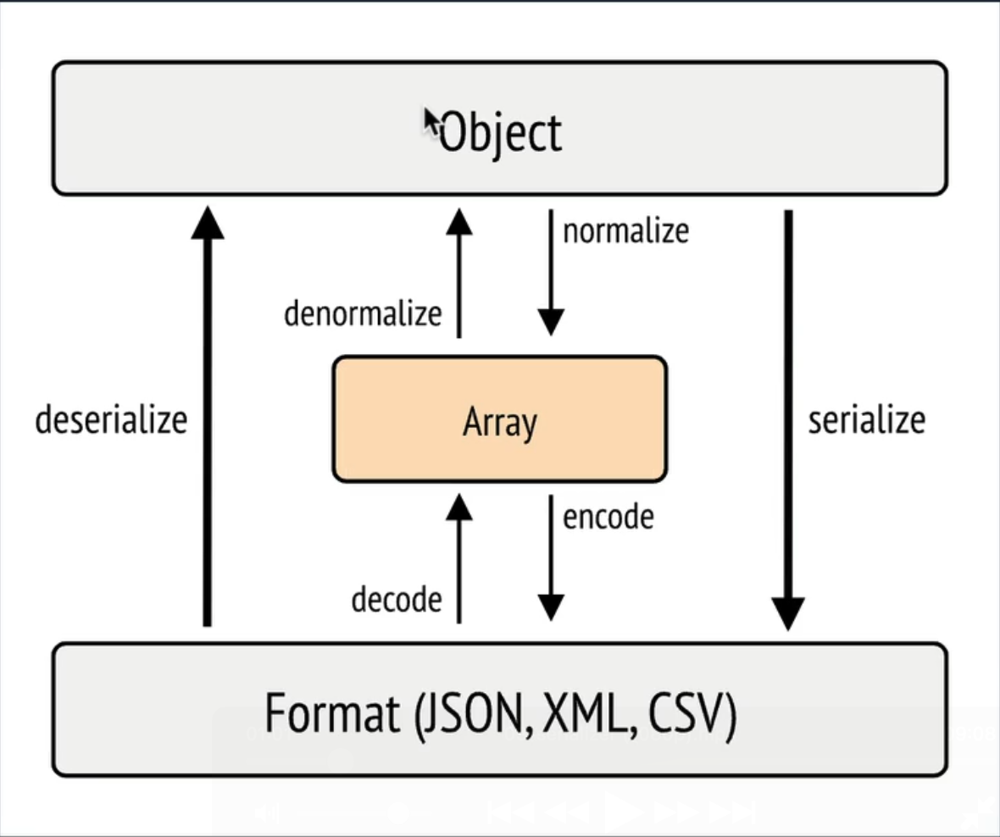

# Part 1: Mythically Good RESTful APIs

## Table des matières :

- [Lexique](#Lexique)
- [#[ApiResource]](#ApiResource)
- - [Propriétés virtuelles](#Propriétés-virtuelles)
- - [Groupes de serialization](#Groupes-de-serialization)
- - [Pagination](#Pagination)
- [Les filtres](#Les-filtres)
- - [Search Filter](#Search-Filter)
- - [Nouveaux filtres spéciaux](#Nouveaux-filtres-spéciaux)
- - [Examples](#Examples)
- - [Filtre personnalisé](#Filtre-personnalisé)
- - [Filtres sur plusieurs paramètres](#Filtres-sur-plusieurs-paramètres)
- [Les formats de réponse](#Les-formats-de-réponse)


## Lexique

**OpenAPI (anciennement Swagger Specification)**
> C'est un standard de description d'API REST dans un format JSON ou YAML.

**Swagger**
> C'était le nom original, c'est aujourd'hui une suite d'outils autour d'OpenAPI.

**Swagger UI**
> C'est une interface web interactive générée à partir da la config OpenAPI.

**RDF (Resource Description Framework)**
> C'est un standard du W3C conçu pour décrire des ressources et leurs relations.


**JSON-LD (JSON for Linked Data)**
> JSON-LD est un standard du W3C conçu pour représenter des données RDF.

**Hydra**
> Hydra est un vocabulaire RDF du W3C conçu pour décrire les API pour les machines.

**IRI (Internationalized Resource Identifier)**
> C'est une adresse qui désigne une ressource unique au format URI.

**URI (Uniform Resource Identifier)**
> Contrairement aux URL qui n'acceptent que l'ascii (a-z), tous les caractères unicode sont acceptés.

## #[ApiResource]

Dès qu'on applique l'attribut `#[ApiResource]` sur une entité doctrine, on a automatiquement une ressource Api Platform
avec le CRUD complet dans la doc `/api`.

### Propriétés virtuelles

Par défaut, ça retournera toutes les propriétés publiques et tous les getters, donc on peut créer des
`propriétés virtuelles` très facilement en faisant :

```php
public function getTrucBidule(): string
{
    return 'truc bidule';
}
```

Et ça générera automatiquement ce schéma de réponse avec le champ `trucBidule` :

```json
{
  "@id": "/api/treasures/1",
  "@type": "Treasure",
  "id": 1,
  "owner": "/api/users/3",
  "name": "set of ornate jewelry",
  "shortDescription": "Fugit quo perspiciatis est ratione do...",
  "plunderedAtAgo": "2 months ago",
  "trucBidule": "truc bidule"
}
```

### Groupes de serialization

Par défaut, tous les champs sont exposés, mais souvent, il y a certains champs ou certaines méthodes qu'on ne souhaite
pas exposer, pour ce cas de figure, on peut utiliser les `groupes de serialization` (de Symfony) :

```php
#[ORM\Column(length: 255)]
#[Groups(['treasure:read', 'treasure:write'])]
private ?string $name = null;

#[ORM\Column(type: Types::TEXT)]
#[Groups('treasure:read')]
private ?string $description = null;
```

Avec la config suivante dans l'attribut `#[ApiResource]` pour utiliser les groupes :

```php
#[ApiResource(
    shortName: 'Treasure',
    description: 'A rare and valuable treasure.',
    normalizationContext: ['groups' => ['treasure:read']],
    denormalizationContext: ['groups' => ['treasure:write']],
)]
```

Pour rappel, voici à quoi correspondent la `normalisation` et la `denormalisation` :


> ℹ️ **Information**
>
> On peut renommer les champs exposés avec l'attribut `#[SerializedName]`

### Pagination

L'attribut `#[ApiResource]` permet de configurer la pagination pour chaque ressource avec certaines options comme :

```php
#[ApiResource(
    paginationItemsPerPage: 10,
    paginationMaximumItemsPerPage: 100
)]
```

## Les filtres

Les filtres peuvent s'appliquer avec l'attribut `#[ApiFilter(MonFiltre::class)]` qu'on peut mettre soit sur la classe
avec potentiellement l'option `properties` soit directement sur la bonne propriété.
> ⚠️ **Attention**
>
> L'attribut `#[ApiFilter]` a été déprécié et sera supprimé dans Api Platform 5 !  
> On doit préférer l'attribut `#[QueryParameter]` qui lui ne s'applique sur la classe.


La liste des filtres disponibles :

`BooleanFilter`
: Permet de filtrer sur un booléen (`?property=<true|false|1|0>`)

`DateFilter`
: Permet de filtrer sur une date (`?property[<after|before|strictly_after|strictly_before>]=value`)

`ExistsFilter`
: Permet de filtrer les valeurs nulles (`?property=<true|false|1|0>`)

`NumericFilter`
: Permet de filtrer sur un nombre exact (`?property=<int|bigint|decimal...>`)

`RangeFilter`
: Permet de filtrer sur une comparaison numérique (`?property[<lt|gt|lte|gte|between>]=value`)

`OrderFilter`
: Ne permet pas de filtrer, mais de **trier** (`?order[property]=<asc|desc>`)

### Search Filter

Il y avait historiquement le `SearchFilter` qui pouvait recevoir une `strategy` en option.  
Les stratégies étaient :`exact`, `partial`, `start`, `end`, et `word_start`.  
Avec la possibilité de prefixer la stratégie par un `i` pour rendre la recherche `case insensitive`.

Cependant, `SearchFilter` **a été déprécié** et remplacé par 3 nouveaux filtres :

`ExactFilter`
: Permet de filtrer sur une valeur exacte (`?property=value`)

`IriFilter`
: Permet de filtrer sur un IRI (`?property=value`)

`PartialSearchFilter`
: Permet de filtrer sur une correspondance partielle et **case insensitive** (`?property=value`)

### Filtres spéciaux

`PropertyFilter`
: C'est en réalité un **filtre de serialization**, qui permet de réduire les champs récupérés.


`FreeTextQueryFilter`
: Prend en argument un filtre pour pouvoir l'appliquer sur plusieurs propriétés à la fois.


`OrFilter`
: Prend en argument un filtre qui n'est pas obligatoire, on aura un résultat tant qu'au moins un filtre correspond.

### Examples

L'attribut `#[ApiFilter]` qui fonctionne toujours jusqu'à API Platform 5 :

```php
#[ORM\Column]
#[ApiFilter(BooleanFilter::class)]
private bool $isPublished = false;
```

```php
#[ApiFilter(SearchFilter::class, properties: [ 'owner.username' => 'ipartial' ])]
class DragonTreasure
{
}
```

Le nouvel attribut `#[QueryParameter]` qui lui ne fonctionne pas sur les propriétés :

```php
#[QueryParameter(
    key: 'isPublished',
    filter: new BooleanFilter
)]
class DragonTreasure
{
}
```

> ℹ️ **Information**
>
> On notera que contrairement à avant, **il faut instancier** le filtre !

Si la `key` correspond à une propriété, elle sera utilisée, sinon il faut spécifier le nom de la propriété :

```php
#[QueryParameter(
    key: 'fonctionneQuandMeme',
    filter: new BooleanFilter,
    property: 'isPublished',
)]
```

Evidemment, la recherche sera `/?fonctionneQuandMeme=true`

On n'est pas obligé d'écrire `key` à chaque fois, la syntaxe est plus compacte comme ça :

```php
#[QueryParameter('properties', filter: new PropertyFilter())]
class DragonTreasure
{
}
```

Avec la requête `/treasures?properties[]=name&properties[]=shortDescription` on obtiendrait quelque chose comme :

```json
{
  "@id": "/api/treasures/3",
  "@type": "Treasure",
  "name": "collection of ancient tomes",
  "shortDescription": "Praesentium quis ducimus omnis facili..."
}
```

### Filtre personnalisé

Il semblerait qu'on ne puisse plus appliquer les filtres aux sous-propriétés (`owner.username`) comme c'était le cas
avec `#[ApiFilter]`.
À la place, pour les cas plus complexes, il faut créer ses propres filtres.

Avec le `MakerBundle` on peut lancer la commande :

```bash
bin/console make:filter ORM OwnerUsernameFilter
```

Puis personnaliser le fichier généré :

```php
class OwnerUsernameFilter implements FilterInterface
{
    use BackwardCompatibleFilterDescriptionTrait;

    public function apply(QueryBuilder $queryBuilder, QueryNameGeneratorInterface $queryNameGenerator, string $resourceClass, ?Operation $operation = null, array $context = []): void
    {
        $parameter = $context['parameter'];
        $value = $parameter->getValue();
        $value = is_array($value) ? $value[0] : $value;

        $alias = $queryBuilder->getRootAliases()[0];

        $queryBuilder
            ->join(sprintf('%s.owner', $alias), 'owner')
            ->andWhere('LOWER(owner.username) LIKE :username')
            ->setParameter('username', '%' . strtolower($value) . '%');
    }
}
```

Et ensuite, on peut s'en servir comme n'importe quel filtre :

```php
#[QueryParameter('owner.username', filter: new OwnerUsernameFilter())]
class DragonTreasure
{
}
```

La recherche sera `/treasures?owner.username=Dragon`

> 💡 **Conseil**
>
> Il vaut mieux appliquer `LOWER` et `strtolower` pour rendre la recherche case insensitive.

### Filtres sur plusieurs paramètres

Si l'on souhaite créer 2 paramètres de fourchette de dates sans avoir à utiliser les filtres par défaut qui ne sont pas
très "user friendly", on pourrait faire ceci :

```php
#[QueryParameter('plunderDateStart', description: 'Date de départ', constraints: [new Assert\Date()])]
#[QueryParameter('plunderDateEnd', description: 'Date de fin', constraints: [new Assert\Date()])]
class DragonTreasure
{
}
```

A noter que **les 2 paramètres ne correspondent à aucune propriété** de la classe !

Et du coup, on souhaite créer un filtre qui pourra récupérer ces 2 paramètres, mais qui ne correspondra à aucun champs
non plus...
Pour ce faire, il faut appliquer le filtre directement à la ressource dans `#[ApiResource]` comme ceci :

```php
#[ApiResource(
    shortName: 'Treasure',
    description: 'A rare and valuable treasure.',
    filters: [PlunderRangeFilter::class],
)]
#[QueryParameter('plunderDateStart', description: 'Date de départ', constraints: [new Assert\Date()])]
#[QueryParameter('plunderDateEnd', description: 'Date de fin', constraints: [new Assert\Date()])]
class DragonTreasure
{
}
```

> ℹ️ **Information**
>
> On notera que cette fois **il ne faut pas instancier le filtre** ! 😅

Ensuite on peut filtrer sur les dates avec `/treasures?plunderDateStart=2025-01-01&plunderDateEnd=2022-01-31`

## Les formats de réponse

Par défaut, il n'y a qu'un seul format supporté, le `JSON-LD`. Mais il est très simple d'en ajouter de nouveaux,  
admettons que l'on veuille faire l'export CSV le plus rapide de l'histoire :

```php
#[ApiResource(
    shortName: 'Treasure',
    description: 'A rare and valuable treasure.',
    formats: [
        'jsonld',
        'csv' => 'text/csv',
    ],
)]
```

Il faut répéter `jsonld` sans quoi le format ne serait plus disponible, et comme le format `csv` n'est pas supporté par
défaut il faut également ajouter le `Accept` header attendu, ici `text/csv`.

Ensuite, si on fait la requête suivante :

```bash
curl -X GET \
  'https://127.0.0.1:8000/api/treasures' \
  -H 'Accept: text/csv'
```

On aura du CSV !

| name                        | description                               | value  | coolFactor | owner         | plunderedAtAgo |
|-----------------------------|-------------------------------------------|--------|------------|---------------|----------------|
| collection of ancient tomes | Praesentium quis ducimus omnis facilis... | 873409 | 7          | /api/users/11 | 3 months ago   |
| set of golden utensils      | Magnam animi in libero ut est enim eos... | 47175  | 1          | /api/users/5  | 6 months ago   |
